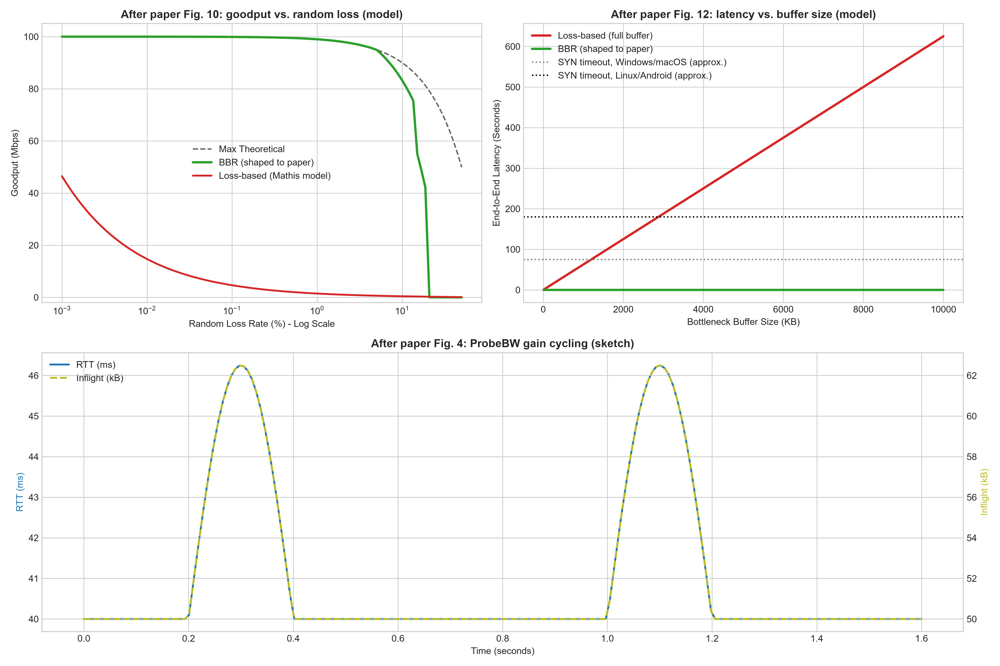

# BBR paper study: redrawing three figures

A small study project from August 2026. I read Google's BBR paper and redrew three of its figures in Python with simple analytical models, to understand why loss-based congestion control struggles on lossy links and with large buffers.

**What this is not:** an implementation or simulation of BBR. Nothing in this repo sends packets, runs a network emulator, or executes BBR's state machine. The BBR curves are shaped by hand to follow the results the paper reports. Only the loss-based (CUBIC-like) curves are computed from a model.

Paper: N. Cardwell, Y. Cheng, C. S. Gunn, S. Hassas Yeganeh, V. Jacobson. *BBR: Congestion-Based Congestion Control.* Communications of the ACM 60(2), 2017. [doi:10.1145/3009824](https://doi.org/10.1145/3009824) · [free version on ACM Queue](https://queue.acm.org/detail.cfm?id=3022184)



## What each panel does

| Panel | Paper figure | Setting (from the paper) | How the curves are produced |
|---|---|---|---|
| Goodput vs. random loss | Fig. 10 | 100 Mbps link, 100 ms RTT, 0.001–50% loss | Loss-based: Mathis et al. model, `rate = (MSS/RTT) · C/√p` with C = √(3/2), capped at the link rate. BBR: a piecewise curve following the paper's statement that BBR reaches the `link rate × (1 − loss)` limit up to 5% loss and stays close up to 15%. |
| Latency vs. buffer size | Fig. 12 | 128 kbps link, 40 ms RTT | Loss-based: RTT = base RTT + (buffer ÷ link rate), i.e. the buffer is always full. BBR: flat at about the base RTT, since BBR keeps inflight near one BDP. |
| ProbeBW gain cycling | Fig. 4 | Illustration | A sketch of inflight rising by up to 25% during a probe phase and RTT rising with it. Not measured. |

## Limitations

- The Mathis model describes Reno-style TCP, so at very low loss it predicts less throughput than CUBIC actually gets (about 46 Mbps at 0.001% loss here, while the paper measures CUBIC near the link rate). It shows the trend, not CUBIC's exact numbers.
- These are closed-form sketches, not measurements. They can't show anything the paper doesn't already say, and they leave out real effects such as competing flows, ACK aggregation and BBR's ProbeRTT phase.
- The next step would be to run real BBR (Linux `tcp_bbr`) and CUBIC flows through an emulated link, such as Mahimahi or `tc netem`, and compare the measurements with the paper's figures.

## Run

```bash
pip install numpy matplotlib
python main.py   # writes results/bbr_replication_results.png
```

My reading notes on the paper are in [`README_NOTES.md`](README_NOTES.md).
